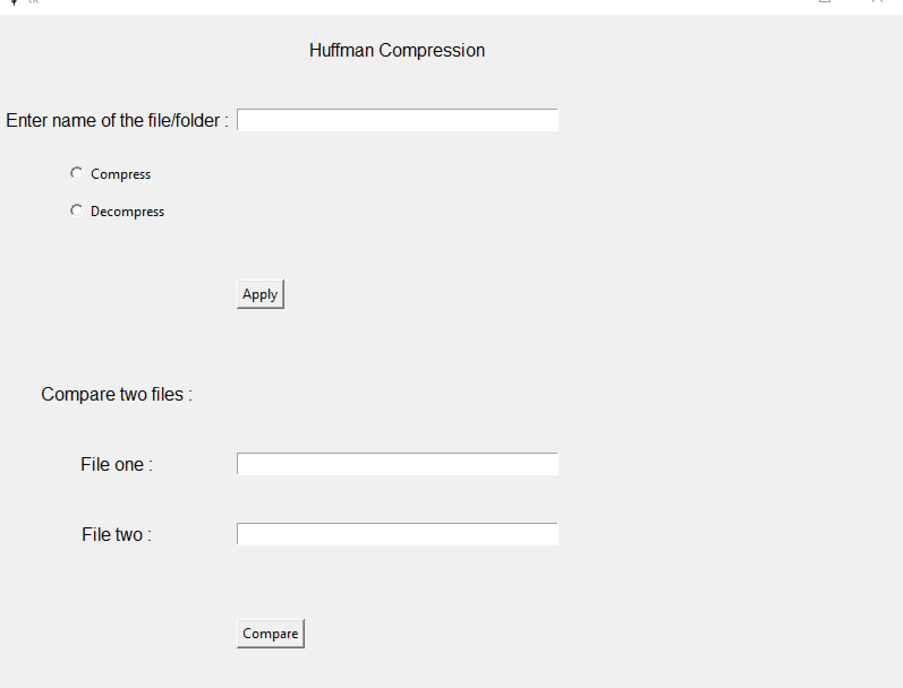
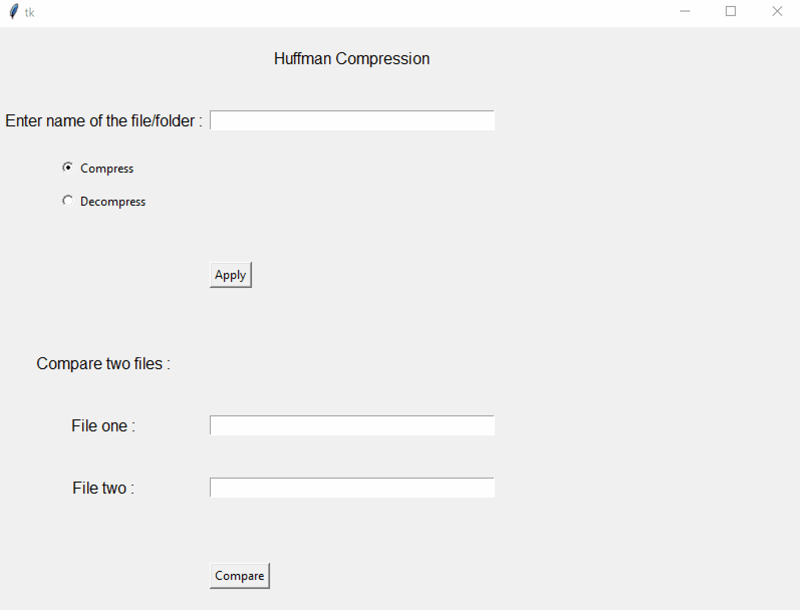
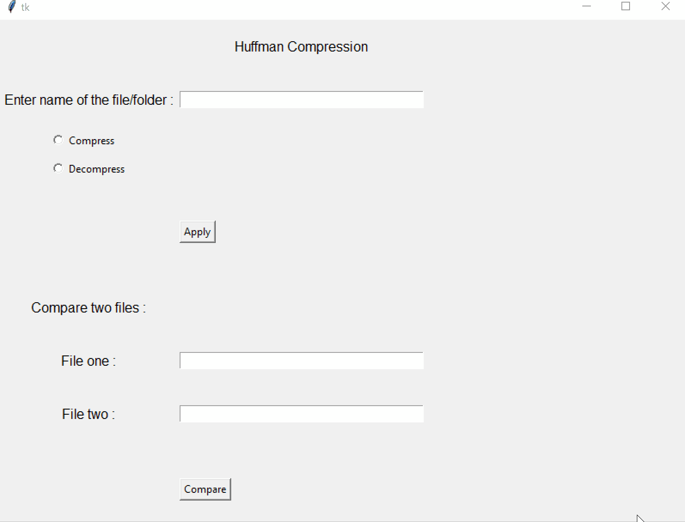

# Huffman Compression
Compress files using Huffman-Compression algorithm
## Available Options
1. Compress a file or directory
2. Decompress a compressed file
## Simulation
### Compress

### Decompress

#### Check If two files are identical

